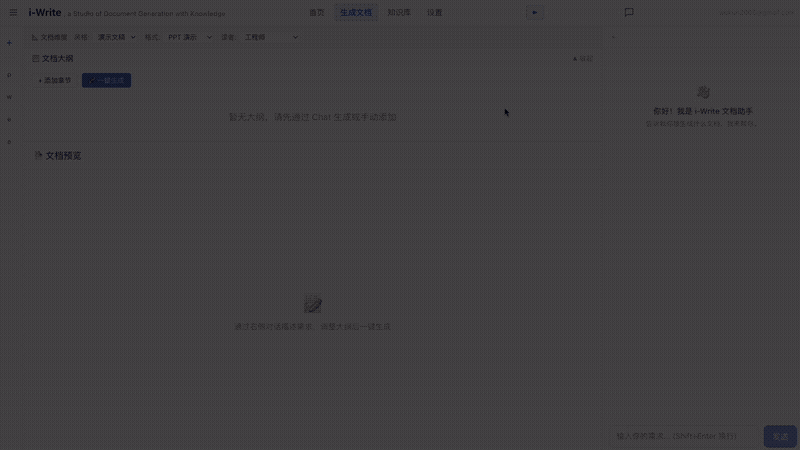

# i-Write · Document Studio

> 不是帮你写，而是帮你敢用 — 让 AI 生成的内容每句话都有据可查

<p align="center">
  
</p>

<p align="center">
  <a href="https://1drv.ms/v/c/203d7a34c28a5187/IQDTURF_I-ElSo1p2NlZCdtNAZHeU9sXO8jpBfvL-Zpyp6U?e=TblyKG">▶️ 查看完整 Demo 视频</a>
  &nbsp;&nbsp;|&nbsp;&nbsp;
  <a href="https://www.bilibili.com/video/BV17oMb6KEQy/">▶️ B 站 2 分钟 Demo</a>
</p>

---

## 快速开始

```bash
npm install
npm run dev
```

浏览器访问 **http://localhost:5173**，预置 Demo 知识库开箱即用。

---

## 核心功能

| 功能 | 说明 |
|------|------|
| Chat Box 交互 | 智能判断需求复杂度，简单直接生成，复杂多轮追问 |
| 叙事引擎 | 大纲生成 → 用户调整 → 一键生成全文 |
| RAG 引擎 | 混合检索（BM25 + 向量 + RRF 融合）+ 重排序 + Groundedness 验证 |
| 文档生成 | 导出 Word / PowerPoint / Excel |
| 生成树可视化 | 段落级溯源，点击任意段落查看来源文档 + 置信度 |
| 信任度报告 | 4 维度量化评分：有据可查度 / 相关度 / 完整度 / 无冲突率 |
| 知识源连接 | 本地文件 + OneDrive + GitHub + arXiv + Outlook + Teams |
| 多 Provider 配置 | 用户自选 LLM / Embedding / Reranker，支持 OpenAI 兼容接口 |
| 离线评估平台 | Golden Set + Multi-Judge，10+ 指标量化生成质量 |
| Office Add-in | Word / Excel / PowerPoint 侧边栏，不离开办公软件即可生成 |

---

## 一个被所有人忽略的问题

### AI 写得越来越好，但用户越来越不敢用

ChatGPT、Claude、Copilot 都在解决"生成效率"——谁写得更快、谁的模板更多、谁的模型更强。
但**没人解决"信任"问题**：AI 生成了一封邮件，看着挺像那么回事，但"感觉不太对"——到底哪里不对？说不出来。
只好逐句翻原文核对，这比从头写还累。

> **i-Write 的核心创意：把"信任"从模糊的直觉，变成了一组用户可以直接使用的产品功能。**

<div align="center">

| 传统方式 | i-Write 方式 |
|---------|------------|
| AI 生成 → "感觉不太对" | AI 生成 → 4 维度量化评估 |
| 逐句翻原文核对 | 置信度热力图一眼看出哪些段落缺底气 |
| 比从头写还累 | 来源溯源树追溯到每句话的出处 |
| 硬着头皮发出去（担风险） | 发出一份自己敢负责任的文档 |
| 或放弃 AI，自己写（回到原点） | 有据可查度 / 相关度 / 完整度 / 无冲突率 |

</div>

---

## 5 个创意亮点

> 不是在已有赛道上做得更好，而是重新定义了赛道

### 01 — 翻转产品定义：从"生成效率"到"信任决策"

行业共识：AI 文档工具 = 帮你写得更快更好。

**i-Write 的翻转**：AI 文档工具 = 帮你**敢用** AI 生成的内容。
不是"写得快"，而是"发得出去"；不是"内容丰富"，而是"每句话都有据可查"。
核心产品定义从"生成效率工具"变成了"**信任决策工具**"。

### 02 — 可量化的信任：从"感觉不对"到"指标说话"

传统做法：用户凭直觉判断 AI 内容是否可信。

**i-Write 的翻转**：把"信任"变成四维度量化指标——有据可查度、内容相关度、内容完整度、无冲突率。
**从老中医凭经验诊脉，到医学检测报告给出量化指标**。

### 03 — 可调试的文档生成：给 AI 加一个 debugger

现有 AI 文档生成是"黑盒"——输入需求，吐出文档，中间过程不可见。

**i-Write 的翻转**：首创"**可调试的文档生成**"——每个段落追溯到具体来源文档，你可以拖拽调整来源优先级、删除不相关来源，AI 基于你的调整重新生成。

### 04 — 冲突检测：文档的"安全扫描"

所有 AI 文档工具都有致命盲区：如果来源信息本身就互相矛盾怎么办？

**i-Write 的翻转**：生成前就自动解决冲突。对高严重度冲突，按权威度和时间信号自动裁决，败方内容直接排除——**矛盾内容坚决不进文档**。

### 05 — 知识源"配方"：新的人机协作模式

i-Write 发现一个被忽略的洞察：文档质量不仅取决于 AI 的能力，更取决于你喂给它什么知识。

**i-Write 的翻转**：把"选择和调整知识源"变成了一等公民交互——拖拽知识源优先级、删除不相关来源、添加新来源，AI 基于"**知识配方**"重新生成。

---

## 竞品对比

i-Write 填补了"跨知识源 + AI 生成 + 可信评估"的市场空白

| 竞品 | 生成文档 | 事实溯源 | 跨平台知识 | 可信评估 | 冲突检测 | 来源调试 |
|------|:---:|:---:|:---:|:---:|:---:|:---:|
| ChatGPT / Claude | ✓ | ✗ | ✗ | ✗ | ✗ | ✗ |
| Google NotebookLM | ✗ | ✓ | ✗ | ✗ | ✗ | ✗ |
| Microsoft Copilot | ✓ | ✓ | ✗ | ✗ | ✗ | ✗ |
| Gamma | 仅 PPT | ✗ | ✗ | ✗ | ✗ | ✗ |
| **i-Write** | ✓ | ✓ | ✓ | ✓ | ✓ | ✓ |

---

## 解决方案架构

```
┌─────────────────────────────────────────────────────────────┐
│                    用户输入需求                               │
│                        │                                    │
│                        ▼                                    │
│  ┌─────────────────────────────────────────────────────┐   │
│  │           Chat Router（智能判断）                     │   │
│  │  简单需求直接生成 · 复杂需求多轮追问                  │   │
│  └──────────────────────┬──────────────────────────────┘   │
│                         │                                   │
│                         ▼                                   │
│  ┌─────────────────────────────────────────────────────┐   │
│  │           Narrative Engine（叙事引擎）               │   │
│  │  大纲生成 → 章节分配 → 风格适配 → 用户调整           │   │
│  └──────────────────────┬──────────────────────────────┘   │
│                         │                                   │
│                         ▼                                   │
│  ┌─────────────────────────────────────────────────────┐   │
│  │           RAG Engine（检索增强生成）                 │   │
│  │  Query Expansion → Hybrid Search → Rerank → Verify  │   │
│  │  BM25 + 向量 + RRF 融合 · 三级 Reranker 降级         │   │
│  └──────────────────────┬──────────────────────────────┘   │
│                         │                                   │
│           ┌─────────────┴─────────────┐                    │
│           ▼                           ▼                    │
│  ┌─────────────────┐       ┌─────────────────────┐        │
│  │  Doc Generator   │       │  Provenance Tree    │        │
│  │  Word/PPT/Excel  │       │  段落级来源 + 置信度  │        │
│  └────────┬────────┘       └──────────┬──────────┘        │
│           │                           │                    │
│           └─────────┬─────────────────┘                    │
│                     ▼                                      │
│  ┌─────────────────────────────────────────────────────┐   │
│  │           Groundedness Check（事实验证）             │   │
│  │  LLM-as-Judge 逐句验证 · 过滤幻觉 · 生成信任度报告   │   │
│  └─────────────────────────────────────────────────────┘   │
│                                                             │
│  ┌─────────────────────────────────────────────────────┐   │
│  │           知识源（多源统一检索）                      │   │
│  │  📁 本地文件  ☁️ OneDrive  🔀 GitHub  📧 Outlook     │   │
│  │  💬 Teams     🔬 arXiv   Excel  Word Powerpoint     │   │
│  └─────────────────────────────────────────────────────┘   │
└─────────────────────────────────────────────────────────────┘
```

---

## 量化信任度评估

i-Write 不是简单地说"这份文档可信"，而是用 **4 个用户可见指标 + 6 个底层支撑指标**，把"信任"拆解成用户可以审查、可以判断、可以行动的量化证据。

### 用户看到的 4 个核心指标

| 指标 | 定义 | 回答什么问题 |
|------|------|------------|
| 🔍 有据可查度 | AI 生成的声明中，有多少有真实来源支撑（非编造、非推测） | 这段话是真的还是 AI 编的？ |
| 🎯 内容相关度 | 生成的内容是否与用户需求直接相关，是否有离题废话 | 这些内容有没有偏题？ |
| 📋 内容完整度 | 用户需求中的所有要点是否被充分覆盖和展开 | 有没有遗漏什么重要信息？ |
| 🛡️ 无冲突率 | 不同知识来源之间是否存在互相矛盾的信息 | 里面的数据有没有打脸的风险？ |

**这意味着什么？** 用户不再需要"逐句翻原文核对"，而是根据指标精准定位问题段落、有依据地修改。

### 6 个底层支撑指标（默默工作）

| 底层指标 | 说明 |
|---------|------|
| **Groundedness Check** | LLM-as-Judge 逐句核查：把 AI 生成的内容拆成一个个声明，让另一个 LLM 判断每个声明是否有真实来源支撑 |
| **Fidelity Check** | 生成前拦截：当 RAG 检索到的文档与章节主题不相关时直接过滤——不让无关内容进入生成流程 |
| **Conflict Detection + Auto-Resolution** | LLM 对比跨源声明识别矛盾，高严重度冲突自动按权威度和时间信号裁决 |
| **Relevance Check** | LLM 逐句判断内容是否与原始需求相关，标记离题废话 |
| **Completeness Check** | LLM 从需求中提取所有要点，逐一检查是否被充分覆盖，列出遗漏项 |
| **Paragraph-Level Provenance** | 每个段落追溯到具体来源文档的 chunk 级别，构建来源溯源树 |

### 冲突检测的分级处置

冲突检测是 i-Write 区别于所有竞品的独特能力——**生成前就自动解决跨源矛盾**：

| 级别 | 处理方式 | 原则 |
|------|---------|------|
| **1. 自动解决（高严重度）** | LLM 裁决 → 权威度高的胜出 → 败方内容直接排除 | 矛盾内容坚决不进文档 |
| **2. 兜底排除（无法裁决）** | 所有冲突侧全部排除 | 宁可少写一段，不让矛盾混入 |
| **3. Highlight 给用户（非高严重度）** | 保留所有来源 → 标注冲突 | 用户自己决定采信哪一方 |

### 置信度热力图

每个段落用颜色标注其来源质量，让用户一眼看出哪些段落需要重点审查：

| 颜色 | 含义 | 行动建议 |
|------|------|---------|
| 🟢 绿色 | 多源交叉验证（2+ 来源支撑） | 可以放心使用 |
| 🟡 黄色 | 仅单个来源支撑 | 需要确认该来源是否可靠 |
| 🔴 红色 | AI 推测（无直接来源） | **必须重点审查或重写** |

### 来源溯源树

点击任意段落，右侧展开来源溯源树，显示"这句话来自哪份文档的哪一段"。
用户可以拖拽调整来源优先级、删除不相关来源，AI 基于调整重新生成该段落。

**这就是"可调试的文档生成"**——给 AI 生成过程加上了一个 debugger。

---

## 离线评估平台

用固定测试集量化系统质量，确保每次配置变更不会导致质量退化：

- **Golden Set**：按场景 × 难度矩阵生成标准测试集
- **Multi-Judge**：2-3 个 LLM judge 独立打分，取算术平均，消除单模型偏差
- **10+ 指标**：NDCG@K、Faithfulness、Recall@K、Answer Correctness、Fact Coverage 等
- **历史对比**：每次评估保留报告，横向对比不同配置的质量趋势

---

## License

MIT
